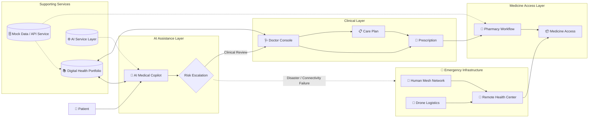

# AERODAVA

> *The drone was the starting point of Aerodava. Accessible healthcare is now the bigger idea.*

Aerodava is a layered healthcare-access platform that connects patients, AI assistance, clinical professionals, and emergency logistics into one continuous flow of care — with drones repositioned as an **emergency-only logistics layer** rather than a routine delivery mechanism.

---

## 🩺 Problem

Rural and hard-to-reach regions face two overlapping issues:
- Physical access to healthcare/medicine breaks down during disasters or infrastructure failure
- Even with access, patients often can't understand prescriptions, reports, or when a symptom needs urgent attention

Aerodava addresses both: everyday healthcare access + communication, with hardware (drones) reserved strictly for scenarios where conventional transport fails.

---

## ✨ Features

### 1. AI Medical Copilot
- **Symptom Guidance:** Conservative, first-step guidance with red-flag detection; clinical decisions stay strictly with doctors, not the AI
- **Document Understanding:** Parses prescriptions/reports and explains them in plain language, with safe supportive suggestions

### 2. Connected Clinical Consultation
- **Digital Health Portfolio:** Persistent record of medical history, reports, and past prescriptions
- **Doctor Console:** AI generates a concise clinical brief on escalation so doctors can review fast and issue a structured Care Plan

### 3. Automated Pharmacy Workflow
- Doctor-approved prescriptions auto-populate a medicine-access cart
- Includes medicine availability checks and pre-built combo packs (First Aid, Cold & Flu, etc.)

### 4. Resilient Emergency Infrastructure
- **Disaster Logistics:** Triggers emergency mass-orders and drone dispatch to remote health centers when normal supply chains are blocked
- **Human Mesh Network (simulated):** Offline Bluetooth relay protocol that moves critical health alerts toward an internet-connected node during full connectivity blackouts

---

## 🏗️ Architecture

- AI functionality is isolated behind a service layer (`aiService.ts`) so the current simulated logic can be swapped for a real model/API without touching the frontend
- Data layer is fully mocked (`demo-data.ts` + async `apiService.ts`) for 100% reliable live demos — no dependency on external APIs, DB uptime, or network conditions

---

## 🛠️ Tech Stack

- **Frontend:** Next.js 14 (App Router), React 18, TypeScript
- **UI:** Tailwind CSS, shadcn/ui, Lucide icons — custom healthcare color palette
- **Data/Backend:** Client-side mock architecture — seeded data + simulated async service layer (mimics real network/DB latency)

---

## 🚀 Local Setup

1. Clone the repository
2. Run `npm install`
3. Run `npm run dev`
4. Open `http://localhost:3000` in your browser

---

## 🔭 What's Next

- Real hospital, pharmacy, and doctor integrations
- Replace simulated AI with production/domain-specific models
- Extend Human Mesh for real disaster-scale connectivity
- Field validation with hospitals and rural users